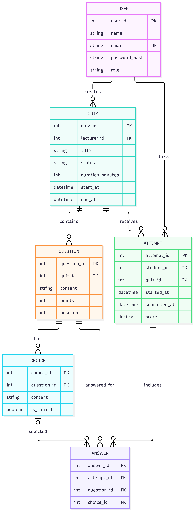
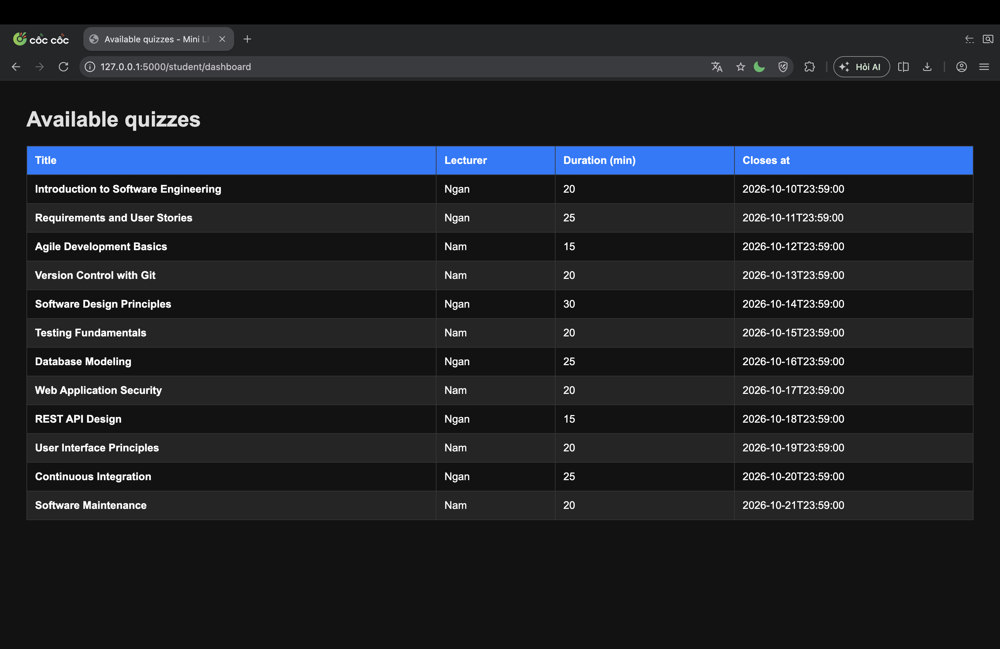

# Milestone 2 — Design Document

## 1. Architecture

## 2. Data model

### ERD



### Table descriptions

| Table | Purpose | Columns | Constraints / Business rules |
|---|---|---|---|
| `user` | Stores lecturer, student, and teaching-assistant accounts. | `user_id` INTEGER PK, `name` TEXT, `email` TEXT UNIQUE, `password_hash` TEXT, `role` TEXT | `email` is unique and required. `role` is required and limited to `lecturer`, `student`, or `ta`; application authorization enforces role-based access (BR1). |
| `quiz` | Stores a lecturer's quiz, its publication state, availability, and time limit. | `quiz_id` INTEGER PK, `lecturer_id` INTEGER FK, `title` TEXT, `status` TEXT, `duration_minutes` INTEGER, `start_at` TEXT, `end_at` TEXT | `lecturer_id` references `user.user_id` (BR2). `status` is required, defaults to `draft`, and is limited to `draft`, `published`, or `closed`. Duration must be positive (US11); when both are set, `end_at` must be later than `start_at`. Attempts respect the earlier duration or closing deadline (BR4). Publication validity requirements are enforced by the service (BR3). |
| `question` | Stores ordered multiple-choice questions belonging to a quiz. | `question_id` INTEGER PK, `quiz_id` INTEGER FK, `content` TEXT, `points` INTEGER, `position` INTEGER | `quiz_id` references `quiz.quiz_id`; `points` and `position` must be positive. `(quiz_id, position)` is unique. Quiz publication requires at least one question and at least two choices per question (BR3; checked by application logic). |
| `choice` | Stores answer options and the correctness flag for a question. | `choice_id` INTEGER PK, `question_id` INTEGER FK, `content` TEXT, `is_correct` INTEGER (0/1) | `question_id` references `question.question_id`. A partial unique index permits at most one correct choice per question; publish validation requires exactly one and at least two choices (BR3). |
| `attempt` | Stores a student's quiz session, submission time, and score. | `attempt_id` INTEGER PK, `student_id` INTEGER FK, `quiz_id` INTEGER FK, `started_at` TEXT, `submitted_at` TEXT, `score` REAL | `student_id` references `user.user_id`; `quiz_id` references `quiz.quiz_id`. A partial unique index permits at most one submitted attempt per student and quiz (BR5). Submitted attempts and scores are append-only through normal application actions (BR6). |
| `answer` | Stores the selected choice for each question in an attempt. | `answer_id` INTEGER PK, `attempt_id` INTEGER FK, `question_id` INTEGER FK, `choice_id` INTEGER FK (nullable) | Foreign keys reference `attempt`, `question`, and `choice`; `(attempt_id, question_id)` is unique. A NULL `choice_id` represents an unanswered question. The application must ensure the selected choice belongs to that question and prevent changes after submission (BR6, US13). |


## 3. API design
| Method | Path | Input | Success | Errors |
| --- | --- | --- | --- | --- |
| GET | /student/dashboard | — | 200 · published quiz listing page (walking skeleton, US05) | 302 → /login if not logged in (BR1, from Sprint 3) |
| POST | /login | email, password | 302 → /lecturer/dashboard or /student/dashboard (US01) | 400 missing fields · 401 incorrect email/password · 429 incorrect 5 times within 10 minutes (US01) |
| POST | /quiz/create | title, description, duration_minutes | 201 · quiz_id, status Draft (US02) | 400 "Quiz title is required" · 403 not a lecturer (BR1) · 422 duration ≤ 0 (US11) |
| POST | /quiz/:id/questions | content, points, choices[], correct_index | 201 · question_id (US03) | 403 not the quiz owner (BR2) · 404 quiz not found · 422 "Please select one correct option" (BR3) |
| POST | /lecturer/quiz/:id/publish | — | 200 · status published (US04) | 403 not the quiz owner (BR2) · 409 already published · 422 invalid quiz (BR3) |
| POST | /student/quiz/:id/take | — | 201 · attempt_id, remaining time (US06) | 403 quiz not published or already closed (US04) · 409 "You have already submitted this quiz" (BR5) |
| POST | /student/quiz/:id/submit | attempt_id, answers[], confirm | 200 · score, submission time (US08) | 409 already submitted (BR5, US13) · 422 unanswered questions remain without confirmation (US08) |
| GET | /lecturer/dashboard | — | 200 · lecturer's quiz list (US14) | 403 not a lecturer (BR1) |

## 4. Walking skeleton

- Selected route: `GET /student/dashboard`
- Database table: `quiz`, joined with `user` to display the lecturer's name.
- Rows displayed: 12 published quizzes; draft quizzes are excluded.
- Database query executed:

  ```sql
  SELECT
      q.quiz_id,
      q.title,
      u.name AS lecturer_name,
      q.duration_minutes,
      q.end_at
  FROM quiz q
  JOIN user u ON u.user_id = q.lecturer_id
  WHERE q.status = 'published'
  ORDER BY q.end_at ASC;
  ```

- Runtime proof:

  

- Setup instructions: See [docs/SETUP.md](SETUP.md).

## 5. Design decisions

## 6. What changed since M1

| Date | Author | Change Description | Affected Story / BR | Issue |
| :--- | :--- | :--- | :--- | :--- |
| 2026-09-27 | Anh Thu | Added US14 (Lecturer Dashboard) to list owned quizzes and attempt counts | US14, BR1 | #49 |
| 2026-09-27 | Anh Thu | Updated US03 criteria to allow at least 2 choices per question, aligning with BR3 and ERD | US03, BR3 | #29 |
| 2026-09-28 | Anh Thu | Added new persona - Mai (TA) and audit-reading permission | US12 | #37 |