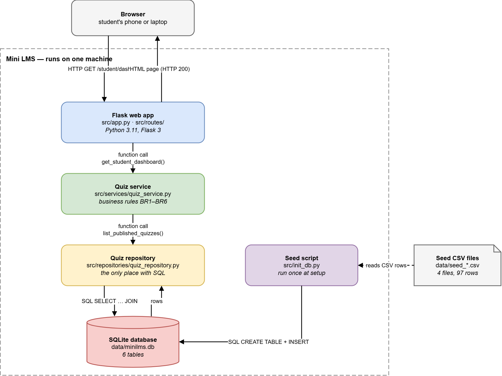

# Milestone 2 — Design Document

## 1. Architecture

The diagram shows the container level of the C4 model for the Sprint 2
walking skeleton. Everything inside the dashed box runs on one machine;
the seed CSV files are an external data source used once during setup.

| Component | Runs where | Technology | Responsibility |
|---|---|---|---|
| Browser | Student's phone or laptop | Any modern browser | Sends HTTP requests and shows the HTML pages |
| Flask web app (`src/app.py`, `src/routes/`) | Local Python process, port 5000 | Python 3.11, Flask 3 | Receives requests, calls the service, renders templates. No SQL and no business rules here. |
| Quiz service (`src/services/quiz_service.py`) | Same Python process | Python | The one module that holds business rules BR1–BR6 |
| Quiz repository (`src/repositories/quiz_repository.py`) | Same Python process | Python sqlite3 | The only module that contains SQL |
| SQLite database (`data/minilms.db`) | File on disk | SQLite 3 | Stores the 6 tables of Section 2 |
| Seed script (`src/init_db.py`) | Run once from the command line | Python | Creates the tables and loads the seed data |
| Seed CSV files (`data/seed_*.csv`) | Files in the repository | CSV | 7 users, 15 quizzes, 15 questions, 60 choices |

**One request end to end (walking skeleton):**

1. The browser sends `GET /student/dashboard`.
2. The route in `src/routes/student_routes.py` calls `get_student_dashboard()` in the quiz service.
3. The service calls `list_published_quizzes()` in the quiz repository.
4. The repository runs one `SELECT … JOIN` on `data/minilms.db` and returns the rows.
5. The route renders `student_dashboard.html`; the browser shows 12 published quizzes.

Business rules live in one module so that every route enforces them the same
way and they can be unit-tested without a browser (see ADR 2 in Section 5).
Sign-in (US01) and the attempt timer (US06, US11) arrive in Sprint 3 as new
routes and service functions; they do not add new containers.

## 2. Data model

### ERD

### Table descriptions

| Table | Purpose | Columns | Constraints / Business rules |
|---|---|---|---|
| `USER` | Stores user accounts for lecturers and students. | `user_id` INT PK, `name` STRING, `email` STRING UNIQUE, `password_hash` STRING, `role` STRING | `user_id` uniquely identifies each user. `email` is unique so one email cannot be used by multiple accounts. `role` distinguishes lecturers from students. |
| `QUIZ` | Stores a lecturer's quiz, its publication state, and the availability and time-limit settings used for student attempts. | `quiz_id` INT PK, `lecturer_id` INT FK, `title` STRING, `status` STRING, `duration_minutes` INT, `start_at` DATETIME, `end_at` DATETIME | `lecturer_id` references `USER.user_id`; it identifies the quiz owner and is used to enforce BR2 (only that lecturer can edit or publish the quiz). A quiz has one owner and may contain many questions and receive many attempts. `status` represents draft, published, or closed state. `duration_minutes` must be positive when set; an attempt must end at the earlier of its duration limit or `end_at` (BR4). Publication requires at least one valid question, with at least two choices and exactly one correct choice per question (BR3). `start_at` and `end_at` define availability. |
| `QUESTION` | Stores the ordered multiple-choice questions that make up a quiz and contribute to its automatically graded score. | `question_id` INT PK, `quiz_id` INT FK, `content` STRING, `points` INT, `position` INT | `quiz_id` references `QUIZ.quiz_id`. Each question belongs to exactly one quiz. `position` determines display order and should be unique within a quiz. Each question needs at least two choices and exactly one correct choice before its quiz can be published (BR3). `points` contributes to the score calculated upon submission. |
| `CHOICE` | Stores the available answer options for a question and identifies the correct option used by automatic grading. | `choice_id` INT PK, `question_id` INT FK, `content` STRING, `is_correct` BOOLEAN | `question_id` references `QUESTION.question_id`. Each choice belongs to one question. A publishable question has at least two choices and exactly one choice with `is_correct = true` (BR3). The correct-answer flag supports grading and review; whether students may see correct answers is controlled by the lecturer's answer-review setting (US09). |
| `ATTEMPT` | Stores a student's quiz session, its submission state and timestamp, and the score calculated from the submitted answers. | `attempt_id` INT PK, `student_id` INT FK, `quiz_id` INT FK, `started_at` DATETIME, `submitted_at` DATETIME, `score` DECIMAL | `student_id` references `USER.user_id` and must identify a student; `quiz_id` references `QUIZ.quiz_id`. Each attempt belongs to one student and one quiz. The attempt starts only when the student is eligible and the quiz is available. `submitted_at` records the single final submission; after submission, answers, score, and event history are immutable through normal application actions (BR6). Enforce at most one submitted attempt per student and quiz (BR5), and reject duplicate submission requests (US12/US13). |
| `ANSWER` | Stores the choice selected for a question in a particular attempt, providing the source data for grading and answer review. | `answer_id` INT PK, `attempt_id` INT FK, `question_id` INT FK, `choice_id` INT FK | `attempt_id` references `ATTEMPT.attempt_id`; `question_id` references `QUESTION.question_id`; `choice_id` references `CHOICE.choice_id` and may be NULL while unanswered. Each answer belongs to one attempt and one question. Enforce at most one answer per `(attempt_id, question_id)` and ensure the selected choice belongs to that question. Submitted answers are immutable as part of BR6. |

## 3. API design

## 4. Walking skeleton

## 5. Design decisions
Both decisions are also kept as separate records in `docs/adr/`
(`0001-sqlite.md`, `0002-layered-architecture.md`), because our process
(`docs/process.md`) requires an ADR for any decision that affects the
database schema.

### ADR 1 — SQLite instead of PostgreSQL

**Status:** Accepted · Sprint 2 · Owner: @dnhhien

**Context.** Mini LMS stores six tables: `user`, `quiz`, `question`,
`choice`, `attempt` and `answer` (Section 2). The instructor must install
and run the project on a machine we have never seen, using only
`docs/SETUP.md`. Some business rules must hold even if the application code
has a bug: BR3 (exactly one correct choice per question), BR5 (at most one
submitted attempt per student and quiz) and BR6 (submitted attempts are
never changed).

**Options**

1. **SQLite file** (`data/minilms.db`), opened with Python's built-in
   `sqlite3` module.
2. **PostgreSQL in Docker**, opened with the `psycopg` driver.
3. **CSV files** read into memory when the app starts and written back on
   every change.

**Chose:** Option 1, SQLite.

**Why**

- *Setup on an unknown machine.* SQLite ships with Python, so SETUP.md lists
  only Git and Python 3.11+ as prerequisites. PostgreSQL would add Docker
  Desktop: a large download that often needs virtualisation enabled in the
  BIOS on Windows laptops. That puts the 15-minute setup at risk for no
  benefit at our scale.
- *Rules enforced by the database, not only by code.* SQLite supports
  FOREIGN KEY, CHECK and partial UNIQUE indexes. `src/schema.py` uses
  `one_correct_choice_per_question` to enforce part of BR3 and
  `one_submitted_attempt_per_student_quiz` to enforce BR5, and `src/db.py`
  turns on `PRAGMA foreign_keys = ON` for every connection. CSV files
  (option 3) cannot enforce any of these rules. Two students saving at the
  same time could also overwrite each other's file, so option 3 was
  rejected.
- *Data size.* One course has at most a few hundred students. Even
  300 students × 20 quizzes × 20 questions is about 120,000 `answer` rows,
  which a single SQLite file handles comfortably.
- *Fast, real tests.* Each test creates a fresh database in a temporary
  folder, runs the real schema and loads the 97 seed rows. The current suite
  of 7 tests finishes in about 0.1 s, so CI can test real SQL on every pull
  request.

**What would change our mind**

- If a test with 30 students submitting at the same moment produces
  `database is locked` errors or a lost submission, we will move to
  PostgreSQL in Sprint 4. Because only `src/db.py` and the repositories touch
  the database (ADR 2), the change stays inside those files.
- If the staging server we deploy to cannot keep a file between restarts,
  SQLite would lose data there, and we would switch to a hosted PostgreSQL.

### ADR 2 — Three layers: routes, services, repositories

**Status:** Accepted · Sprint 2 · Owner: @dnhien

**Context.** BR1–BR6 apply across many routes. BR5 must be checked both when
a student starts a quiz (`POST /student/quiz/<id>/take`) and when they submit
it (`POST /student/quiz/<id>/submit`). Some rules cannot be written as a
single database constraint. For example, BR3 also requires every question to
have at least two choices, which needs counting rows before a quiz is
published. Our Definition of Done requires an automated test for every story.

**Options**

1. **Everything in the route functions** in `src/app.py`: each route reads
   the request, checks the rules, runs SQL and renders the page.
2. **Three layers:** routes in `src/routes/` handle HTTP only; services in
   `src/services/` hold the business rules; repositories in
   `src/repositories/` hold all SQL.
3. **ORM models** with Flask-SQLAlchemy, putting queries and rules on model
   classes.

**Chose:** Option 2, three layers.

**Why**

- *One place for each rule.* `src/services/quiz_service.py` is the single
  module that enforces BR1–BR6 in code, so the start route and the submit
  route cannot check BR5 in two different ways. With option 1 the same check
  would be copied into several routes and drift apart over time.
- *Testable without a browser.* Service functions are plain Python. Tests
  call them directly with a temporary database, the same way
  `tests/test_init_db.py` already does. With option 1 every rule could only
  be tested through HTTP requests.
- *SQL in one place.* Only the repositories contain SQL. A schema change,
  which our process treats as high-risk, touches `src/schema.py` and the
  repositories and nothing else. This is also what keeps the move to
  PostgreSQL in ADR 1 cheap.
- *Why not an ORM.* Option 3 adds a library none of us has used and hides
  the SQL. Our schema relies on partial UNIQUE indexes for BR3 and BR5, which
  are clearer as plain SQL in `src/schema.py` than as ORM configuration.
  Learning three folders is faster for five people than learning an ORM
  mid-semester.

**What would change our mind**

- If at the end of Sprint 4 more than half of the service functions only pass
  data from the route to the repository without checking any rule, the
  service layer is not earning its place, and we will merge it into the
  routes.
- If the repositories fill up with near-identical queries whose only job is
  turning rows into objects, we will reconsider an ORM for Milestone 4 and
  record that as ADR 0003.

## 6. What changed since M1
