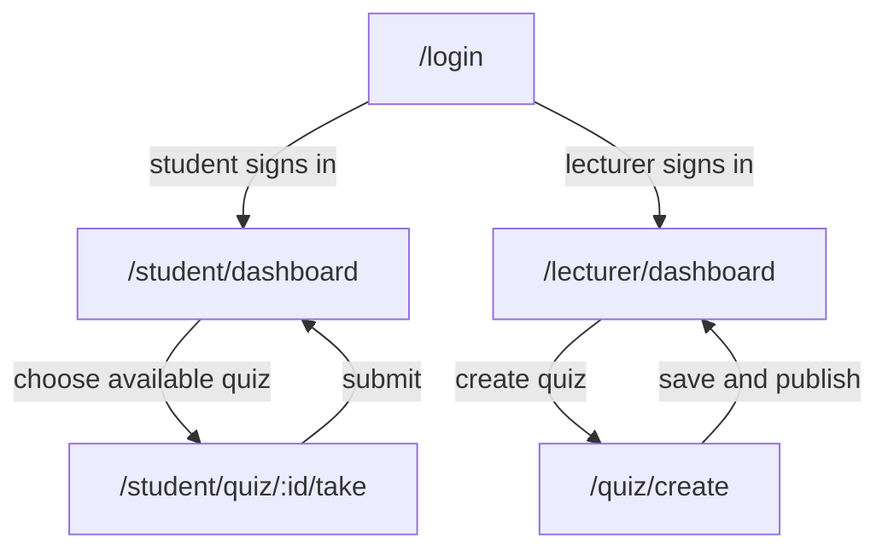

# Mini LMS - Milestone 1 Requirements

## 1. Product vision

Mini LMS is for university lecturers and students who need to create, deliver, complete, and review online quizzes, removing manual quiz administration and delayed marking while providing a more structured and auditable alternative to collecting answers through chat, email, or spreadsheets.

## 2. Personas

### Persona 1 - Ngan, university lecturer

- **Role:** Lecturer teaching a large undergraduate class.
- **Goal:** Create a multiple-choice quiz, publish it to the correct class, and see reliable scores without manually checking every answer.
- **Blocked by:** Re-entering questions in several tools, losing track of quiz versions, and waiting for students to send answers in different formats.
- **In her words:** "I need to know that every student received the same quiz and that the score came from the submitted answers."
- **Technical context:** Uses a laptop for preparation and expects clear validation before publishing.

### Persona 2 - Duc, first-year student

- **Role:** University student taking quizzes on a phone or laptop.
- **Goal:** Find an available quiz, complete it before the deadline, submit it once, and see the result quickly.
- **Blocked by:** Unclear deadlines, losing answers when a session changes, and not knowing whether submission succeeded.
- **In his words:** "When I submit, I want a clear result instead of wondering whether my answers were saved."
- **Technical context:** Uses a phone on campus Wi-Fi and needs readable questions with a visible remaining-time indicator.

**Interview note:**

- Ngan An spoke to Mrs. Ngan on 3.40 p.m, 17th September 2026
- Anh Thu spoke to Duc on 10.31 a.m, 20th September 2026

## 3. Scenarios

### Scenario 1 - Ngan creates and publishes a quiz

1. Ngan signs in as a lecturer before her Monday class.
2. She starts a new quiz and enters the title "Week 3 - Software Engineering".
3. She sets the quiz duration to 20 minutes and adds 10 multiple-choice questions.
4. The system identifies that each question has exactly one correct choice and shows the quiz as ready to review.
5. Ngan reviews the question list, correct choices, duration, and availability dates.
6. She publishes the quiz for her class, and the quiz becomes visible to eligible students.
7. She opens the quiz list and sees the published status and the number of student attempts.

### Scenario 2 - Duc completes and submits a quiz

1. Duc signs in as a student and looks for quizzes currently available to him.
2. He chooses "Week 3 - Software Engineering" and reads its 20-minute duration and deadline.
3. He starts the attempt and answers the 10 multiple-choice questions while the remaining time is visible.
4. Before finishing, he reviews the selected choices and sees that question 7 has no answer.
5. He selects an answer for question 7 and submits the attempt.
6. The system confirms that the attempt was submitted and calculates the score from the stored answers.
7. Duc opens the result and sees his score, the number of correct answers, and the submission time.

## 4. User stories

### 4.1 Story summary

| ID   | Story                                                    | Priority | Points |
| ---- | -------------------------------------------------------- | -------: | -----: |
| US01 | Sign in and receive the correct role                     |       P0 |      3 |
| US02 | Lecturer creates a quiz                                  |       P0 |      5 |
| US03 | Lecturer adds multiple-choice questions                  |       P0 |      5 |
| US04 | Lecturer publishes a quiz                                |       P0 |      3 |
| US05 | Student sees available quizzes                           |       P0 |      3 |
| US06 | Student starts a quiz attempt                            |       P0 |      3 |
| US07 | Student views the score and feedback after submission    |       P1 |      3 |
| US08 | Student submits a quiz                                   |       P0 |      3 |
| US09 | Student sees an automatically calculated result          |       P1 |      5 |
| US10 | Lecturer views quiz statistics                           |       P0 |      5 |
| US11 | Lecturer configures a time limit for a quiz              |       P1 |      5 |
| US12 | Lecturer views an append-only attempt audit history      |       P2 |      3 |
| US13 | Student's quiz attempt is protected from invalid actions |       P1 |      5 |

### 4.2 Acceptance criteria

Each story below has at least two testable criteria. Every block includes a concrete number or an exact expected value.

#### US01 - Sign in and receive the correct role

As a system user (Lecturer/Student), I want to log in and log out of the Mini LMS system with my assigned role, So that I can access the features relevant to my role securely.

- Given a user enters a valid email and password, when they sign in, then the system redirects them to the dashboard for their role.
- Given a lecturer logs in, when they access a quiz created by another lecturer, then the system rejects access with the message “You do not have permission to edit this quiz.”
- Given a student logs in, when they open the student dashboard, then they see only quizzes available to them and not the lecturer management page.

#### US02 - Lecturer creates a quiz

As a lecturer, I want to create a quiz so that I can prepare an assessment for my class.

- Given the lecturer enters the title “Midterm Quiz 1” and description “Week 5 review,” when they save, then a new quiz is created with status “Draft.”
- Given the title field is empty, when the lecturer tries to save, then the system shows the error “Quiz title is required.”
- Given the lecturer sets the quiz duration to 30 minutes, when the quiz is saved, then the system stores the duration as 30 minutes.

#### US03 - Lecturer adds multiple-choice questions

As a Lecturer, I want to add multiple-choice questions with answer choices and correct answers to a created quiz, So that the system can automatically grade student submissions.

- Given a quiz has 0 questions, when the lecturer adds 1 multiple-choice question, then the question count becomes 1.
- Given a question has 4 options and 1 correct answer, when it is saved, then the system stores exactly 4 options and 1 correct answer.
- Given a question is missing a correct answer, when the lecturer tries to save, then the system shows the error “Please select one correct option.”

#### US04 - Lecturer publishes a quiz

As a lecturer, I want to publish and close a quiz, so that students can access it only during the intended period.

- Given a quiz contains 10 valid questions, when the lecturer publishes it, then its status changes to published.
- Given a quiz contains fewer than 1 question, when the lecturer tries to publish it, then publishing is rejected with the message A quiz must contain at least 1 question.
- Given a quiz is closed, when a student tries to start it, then the system rejects the attempt.
- Given a published quiz has received at least 1 attempt, when the lecturer closes it, then existing submitted attempts remain accessible.

#### US05 - Student sees available quizzes

As a student, I want to see quizzes available to me so that I can choose the correct assessment.

- Given the student has access to 6 published quizzes, when they open the dashboard, then 6 quiz cards are displayed.
- Given a quiz is unpublished, when the student opens the dashboard, then it does not appear in the list.
- Given a quiz is due in 2 days, when the dashboard loads, then the system displays the due date next to the quiz.

#### US06 - Student starts a quiz attempt

As a student, I want to start an available quiz so that the system records my attempt and applies its time limit.

- Given a published quiz contains 10 questions, when the student starts the quiz, then all 10 questions are displayed one at a time.
- Given the student selects option B for question 3, when the student moves to another question and returns, then option B remains selected.
- Given the quiz has no unanswered questions, when the student reviews the attempt, then the system displays 0 unanswered questions.
- Given the student is not enrolled or the quiz is unpublished, when the student opens the quiz, then the system rejects access with an appropriate message.
- Given the quiz has a time limit of 30 minutes, when the attempt starts, then the timer begins at 30:00.
- Given a student starts an attempt and refreshes the page, when the page reloads, then the system restores the same question and remaining time.

#### US07 - Student answers and reviews a quiz

As a student, I want to answer and review questions before submission so that I can correct missing or unintended choices.

- **Given** a quiz has 10 questions, **when** the student selects choice `B` for question 7 and moves to question 8, **then** question 7 remains marked as answered with choice `B`.
- **Given** question 7 is unanswered, **when** the student opens the review, **then** the review lists `Question 7` under unanswered questions.

#### US08 - Student submits a quiz

As a student, I want to submit my answers so that my attempt is completed and cannot be changed accidentally.

- **Given** all 10 questions are answered, **when** the student confirms submission, **then** the attempt status becomes `Submitted` and exactly 1 submission timestamp is stored.
- **Given** question 7 is unanswered, **when** the student requests submission, **then** the system lists `Question 7` and requires explicit confirmation before final submission.

#### US09 - Student sees an automatically calculated result

As a student, I want to see my score after submission so that I know my result without waiting for manual marking.

- **Given** a 10-question quiz has 8 correct submitted answers, **when** the attempt is submitted, **then** the result shows `8/10` and `80%`.
- **Given** an attempt has status `In progress`, **when** the student requests its result, **then** no final score is shown and the exact message `Submit the quiz to view the result` appears.

#### US10 - Lecturer views quiz statistics

As a lecturer, I want to view quiz statistics so that I can understand class performance.

- **Given** 20 students submitted a quiz and 15 passed, **when** the lecturer opens the statistics, **then** it shows `20` total attempts and a `75%` pass rate.
- **Given** 0 students have submitted the quiz, **when** the lecturer opens the statistics, **then** it shows `0` attempts and `No results available` instead of dividing by zero.

#### US11 - Lecturer configures a time limit for a quiz

As a lecturer, I want to configure a time limit so that every student receives the same amount of time.

- **Given** a draft quiz exists, **when** the lecturer sets the duration to `20 minutes` and saves, **then** the quiz displays `20 minutes` as its configured duration.
- **Given** the lecturer enters `0 minutes` or `121 minutes`, **when** the duration is saved, **then** the save is rejected and the message states `Duration must be between 1 and 120 minutes`.

#### US12 - Lecturer views an append-only attempt audit history

As a lecturer, I want to view the attempt history so that I can verify submission and grading events.

- **Given** a quiz has 3 submitted attempts, **when** the lecturer opens its audit history, **then** exactly 3 records show student identifier, status, score, and submission time.
- **Given** an audit record has score `8/10`, **when** a user tries to change it to `10/10`, **then** the request is rejected and the stored score remains `8/10`.

#### US13 - Student's quiz attempt is protected from invalid actions

As a student, I want invalid actions to be rejected clearly so that my quiz attempt remains consistent.

- **Given** an attempt is already `Submitted`, **when** the student sends another answer update, **then** the request is rejected with `The attempt is already submitted` and the answer count does not change.
- **Given** the same student has already submitted quiz `Q03` once, **when** the student tries to start `Q03` again, **then** no second submitted attempt is created and the exact message `You have already submitted this quiz` is shown.

## 5. Business rules

### BR1 - Role-based access is enforced

A guest cannot access authenticated quiz data, a student cannot access lecturer management actions, and a lecturer cannot use student-only actions for another role.

**Worked example:** A guest requests `/student/dashboard` at 10:00; the system redirects to `/login`. A student requests `/quiz/create`; the system returns `403 Forbidden`.

### BR2 - Only the quiz owner may edit a quiz

A lecturer may edit or publish only quizzes they created.

**Worked example:** Lecturer Ngan owns quiz Q01. At 09:00 Ngan may edit Q01; lecturer Nam requests the same edit at 09:01 and receives `403 Forbidden`, while Q01 remains unchanged.

### BR3 - A quiz must contain valid questions before publication

A quiz cannot be published unless it contains at least 1 question, every question has at least 2 choices, and exactly 1 choice is marked correct.

**Worked example:** Q02 has 2 questions; question 1 has 4 choices and 1 correct choice, question 2 has 3 choices and 0 correct choices. Publishing Q02 is rejected because the second question has 0 instead of exactly 1 correct choice.

### BR4 - A quiz attempt respects its configured duration and deadline

The attempt cannot continue after the configured duration or the quiz closing time, whichever comes first.

**Worked example:** A quiz opens at 09:00, closes at 10:00, and has a 20-minute duration. An attempt started at 09:45 ends at 10:00 after 15 minutes, not at 10:05.

### BR5 - Each student has at most one submitted attempt per quiz

After a student submits an attempt for a quiz, another submitted attempt for that same student and quiz is rejected.

**Worked example:** Duc submits Q03 at 14:20. At 14:25 he tries to start Q03 again; the system rejects the request with `You have already submitted this quiz` and keeps the submitted attempt count at 1.

### BR6 - Submitted attempts and scores are append-only

After submission, the original answers, score, and event history cannot be updated or deleted through normal application actions.

**Worked example:** A submitted 10-question attempt has score `8/10` at 15:00. At 15:05 a user tries to change it to `10/10`; the request is rejected and the audit history still contains the original `8/10` score.

## 6. Screens and flow

**Access codes:** G = guest, U = authenticated user, A = administrator.

| Route                        | Purpose                                       | Access | Priority |
| ---------------------------- | --------------------------------------------- | ------ | -------- |
| `/login`                     | User authentication & role selection          | G      | P0       |
| `/quiz/create`               | Quiz creation form                            | U      | P0       |
| `/quiz/:id/questions`        | Question & choice management                  | U      | P0       |
| `/student/dashboard`         | Student dashboard with available quiz listing | U      | P0       |
| `/student/quiz/:id/take`     | Student quiz taking screen & anti-cheat       | U      | P0       |
| `/lecturer/quiz/:id/audit`   | Preserve Attempt Audit History                | U      | P2       |
| `/student/quiz/:id/grade`    | Automatic quiz grading & score result         | U      | P1       |
| `/lecturer/quiz/:id/publish` | Lecturer Publishes and Closes Quiz            | U      | P0       |
| `/lecturer/quiz/:id/time`    | Set quiz duration                             | A      | P1       |
| `/student/quiz/:id/submit`   | Submit quiz & confirm completion              | U      | P0       |
| `/student/quiz/:id/review`   | Student views quiz result                     | U      | P1       |



Every listed route appears in the flow and is reachable from `/login` through a role-specific path. The lecturer path returns to `/lecturer/dashboard` after a quiz is saved and published; the student path returns to `/student/dashboard` after an attempt is submitted.
```

Every listed route appears in the flow and is reachable from `/login` through a role-specific path. The lecturer path returns to `/lecturer/dashboard` after a quiz is saved and published; the student path returns to `/student/dashboard` after an attempt is submitted.
    Take -->|submit| Student
```

Every listed route appears in the flow and is reachable from `/login` through a role-specific path. The lecturer path returns to `/lecturer/dashboard` after a quiz is saved and published; the student path returns to `/student/dashboard` after an attempt is submitted.
    Take -->|submit| Student
```

Every listed route appears in the flow and is reachable from `/login` through a role-specific path. The lecturer path returns to `/lecturer/dashboard` after a quiz is saved and published; the student path returns to `/student/dashboard` after an attempt is submitted.
    Student -->|choose available quiz| Take["/student/quiz/:id/take"]
    Take -->|submit| Student
```

Every listed route appears in the flow and is reachable from `/login` through a role-specific path. The lecturer path returns to `/lecturer/dashboard` after a quiz is saved and published; the student path returns to `/student/dashboard` after an attempt is submitted.
    Student -->|choose available quiz| Take["/student/quiz/:id/take"]
    Take -->|submit| Student
```

Every listed route appears in the flow and is reachable from `/login` through a role-specific path. The lecturer path returns to `/lecturer/dashboard` after a quiz is saved and published; the student path returns to `/student/dashboard` after an attempt is submitted.
    Student -->|choose available quiz| Take["/student/quiz/:id/take"]
    Take -->|submit| Student
```

Every listed route appears in the flow and is reachable from `/login` through a role-specific path. The lecturer path returns to `/lecturer/dashboard` after a quiz is saved and published; the student path returns to `/student/dashboard` after an attempt is submitted.
    Create -->|save and publish| Lecturer
    Student -->|choose available quiz| Take["/student/quiz/:id/take"]
    Take -->|submit| Student
```

Every listed route appears in the flow and is reachable from `/login` through a role-specific path. The lecturer path returns to `/lecturer/dashboard` after a quiz is saved and published; the student path returns to `/student/dashboard` after an attempt is submitted.
    Create -->|save and publish| Lecturer
    Student -->|choose available quiz| Take["/student/quiz/:id/take"]
    Take -->|submit| Student
```

Every listed route appears in the flow and is reachable from `/login` through a role-specific path. The lecturer path returns to `/lecturer/dashboard` after a quiz is saved and published; the student path returns to `/student/dashboard` after an attempt is submitted.
    Create -->|save and publish| Lecturer
    Student -->|choose available quiz| Take["/student/quiz/:id/take"]
    Take -->|submit| Student
```

Every listed route appears in the flow and is reachable from `/login` through a role-specific path. The lecturer path returns to `/lecturer/dashboard` after a quiz is saved and published; the student path returns to `/student/dashboard` after an attempt is submitted.
Every listed route appears in the flow and is reachable from `/login` through a role-specific path. The lecturer path returns to `/lecturer/dashboard` after a quiz is saved and published; the student path returns to `/student/dashboard` after an attempt is submitted.

Every listed route appears in the flow and is reachable from `/login` through a role-specific path. The lecturer path returns to `/lecturer/dashboard` after a quiz is saved and published; the student path returns to `/student/dashboard` after an attempt is submitted.

Every listed route appears in the flow and is reachable from `/login` through a role-specific path. The lecturer path returns to `/lecturer/dashboard` after a quiz is saved and published; the student path returns to `/student/dashboard` after an attempt is submitted.
```

Every listed route appears in the flow and is reachable from `/login` through a role-specific path. The lecturer path returns to `/lecturer/dashboard` after a quiz is saved and published; the student path returns to `/student/dashboard` after an attempt is submitted.
```

Every listed route appears in the flow and is reachable from `/login` through a role-specific path. The lecturer path returns to `/lecturer/dashboard` after a quiz is saved and published; the student path returns to `/student/dashboard` after an attempt is submitted.
