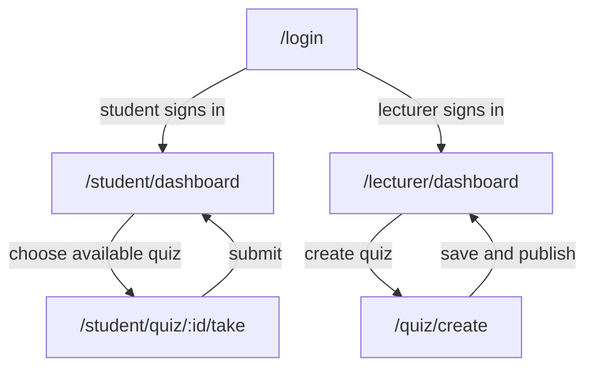

# Mini LMS - Milestone 1 Requirements

## 1. Product vision

Mini LMS is for university lecturers and students who need to create, deliver, complete, and review online quizzes, removing manual quiz administration and delayed marking while providing a more structured and auditable alternative to collecting answers through chat, email, or spreadsheets.

## 2. Personas

### Persona 1 - Ngan, university lecturer

- **Role:** Lecturer teaching a large undergraduate class.
- **Goal:** Create a multiple-choice quiz, publish it to the correct class, and see reliable scores without manually checking every answer.
- **Blocked by:** Re-entering questions in several tools, losing track of quiz versions, and waiting for students to send answers in different formats.
- **In her words:** "I need to know that every student received the same quiz and that the score came from the submitted answers."
- **Technical context:** Uses a laptop for preparation and expects clear validation before publishing.

### Persona 2 - Duc, first-year student

- **Role:** University student taking quizzes on a phone or laptop.
- **Goal:** Find an available quiz, complete it before the deadline, submit it once, and see the result quickly.
- **Blocked by:** Unclear deadlines, losing answers when a session changes, and not knowing whether submission succeeded.
- **In his words:** "When I submit, I want a clear result instead of wondering whether my answers were saved."
- **Technical context:** Uses a phone on campus Wi-Fi and needs readable questions with a visible remaining-time indicator.

**Interview note:** 
  - Ngan An spoke to Mrs. Ngan on 3.40 p.m, 17th September 2026
  - Anh Thu spoke to Duc on 10.31 a.m, 20th September 2026

## 3. Scenarios

### Scenario 1 - Ngan creates and publishes a quiz

1. Ngan signs in as a lecturer before her Monday class.
2. She starts a new quiz and enters the title "Week 3 - Software Engineering".
3. She sets the quiz duration to 20 minutes and adds 10 multiple-choice questions.
4. The system identifies that each question has exactly one correct choice and shows the quiz as ready to review.
5. Ngan reviews the question list, correct choices, duration, and availability dates.
6. She publishes the quiz for her class, and the quiz becomes visible to eligible students.
7. She opens the quiz list and sees the published status and the number of student attempts.

### Scenario 2 - Duc completes and submits a quiz

1. Duc signs in as a student and looks for quizzes currently available to him.
2. He chooses "Week 3 - Software Engineering" and reads its 20-minute duration and deadline.
3. He starts the attempt and answers the 10 multiple-choice questions while the remaining time is visible.
4. Before finishing, he reviews the selected choices and sees that question 7 has no answer.
5. He selects an answer for question 7 and submits the attempt.
6. The system confirms that the attempt was submitted and calculates the score from the stored answers.
7. Duc opens the result and sees his score, the number of correct answers, and the submission time.

## 4. User stories

### 4.1 Story summary
| ID | Story | Priority | Points |
| --- | --- | ---: | ---: |
| US01 | Sign in and receive the correct role | P0 | 3 |
| US02 | Lecturer creates a quiz | P0 | 5 |
| US03 | Lecturer adds multiple-choice questions | P0 | 5 |
| US04 | Lecturer publishes a quiz | P0 | 3 |
| US05 | Student sees available quizzes | P0 | 3 |
| US06 | Student starts a quiz attempt | P0 | 3 |
| US07 | Student answers and reviews a quiz | P1 | 5 |
| US08 | Student submits a quiz | P0 | 3 |
| US09 | Student sees an automatically calculated result | P1 | 5 |
| US10 | Lecturer views an append-only attempt audit history | P2 | 5 |

### 4.2 Acceptance criteria

#### US01 - Sign in and receive the correct role

As a user, I want to sign in so that I receive access to the functions allowed for my role.

- **Given** a registered student enters valid credentials, **when** sign-in succeeds, **then** the system redirects the user to the student dashboard and shows no lecturer-only controls.
- **Given** a registered lecturer enters an incorrect password, **when** sign-in is submitted, **then** the system rejects it and shows the exact message `Invalid email or password` without creating a session.

#### US02 - Lecturer creates a quiz

As a lecturer, I want to create a quiz so that I can prepare an assessment for my class.

- **Given** a lecturer enters the title `Week 3 - Software Engineering`, **when** the quiz is saved, **then** exactly one draft quiz with that title appears in the lecturer's quiz list.
- **Given** the title is empty, **when** the lecturer tries to save, **then** the quiz is not created and the message `Quiz title is required` identifies the missing field.

#### US03 - Lecturer adds multiple-choice questions

As a lecturer, I want to add multiple-choice questions so that students can answer a structured quiz.

- **Given** a draft quiz exists, **when** the lecturer adds one question with 4 choices and marks 1 correct choice, **then** the question appears in the quiz with exactly 4 choices and 1 correct choice.
- **Given** a question has 3 choices and no correct choice, **when** the lecturer saves it, **then** the save is rejected and the message identifies that exactly 1 correct choice is required.

#### US04 - Lecturer publishes a quiz

As a lecturer, I want to publish a completed quiz so that eligible students can take it.

- **Given** a quiz contains 10 valid questions and a duration of 20 minutes, **when** the lecturer publishes it, **then** its status changes from `Draft` to `Published` and it appears in the eligible students' available list.
- **Given** a quiz contains 0 questions, **when** the lecturer tries to publish it, **then** publication is rejected with the exact message `Add at least 1 question before publishing`.

#### US05 - Student sees available quizzes

As a student, I want to see quizzes available to me so that I can choose the correct assessment.

- **Given** 2 published quizzes are available to the student, **when** the student opens the dashboard, **then** both quiz titles, deadlines, and durations are shown.
- **Given** no published quiz is available, **when** the dashboard loads, **then** it shows `No quizzes available` instead of an empty unexplained list.

#### US06 - Student starts a quiz attempt

As a student, I want to start an available quiz so that the system records my attempt and applies its time limit.

- **Given** a published quiz has a 20-minute duration and the student has no existing attempt, **when** the student starts it, **then** exactly 1 attempt is created with status `In progress` and a 20-minute timer begins.
- **Given** the quiz deadline has passed, **when** the student tries to start it, **then** no attempt is created and the message states the exact deadline has passed.

#### US07 - Student answers and reviews a quiz

As a student, I want to answer and review questions before submission so that I can correct missing or unintended choices.

- **Given** a quiz has 10 questions, **when** the student selects an answer for question 7, **then** question 7 is marked as answered and the selected choice remains after moving to another question.
- **Given** question 7 is unanswered, **when** the student opens the review before submission, **then** the review identifies question 7 as unanswered.

#### US08 - Student submits a quiz

As a student, I want to submit my answers so that my attempt is completed and cannot be changed accidentally.

- **Given** a student has answered all 10 questions, **when** the student confirms submission, **then** the attempt status becomes `Submitted` and a submission timestamp is stored.
- **Given** a student tries to submit without answering question 7, **when** submission is requested, **then** the system lists question 7 as unanswered and requires an explicit confirmation before final submission.

#### US09 - Student sees an automatically calculated result

As a student, I want to see my score after submission so that I know my result without waiting for manual marking.

- **Given** a 10-question quiz has 8 correct submitted answers, **when** the attempt is submitted, **then** the result shows `8/10` and `80%`.
- **Given** an attempt has status `In progress`, **when** the student requests its result, **then** the system does not show a final score and shows `Submit the quiz to view the result`.

#### US10 - Lecturer views an append-only attempt audit history

As a lecturer, I want to view the attempt history so that I can verify submission and grading events.

- **Given** a quiz has 3 submitted attempts, **when** the lecturer opens its audit history, **then** exactly 3 attempt records show student identifier, status, score, and submission time.
- **Given** an audit record already exists, **when** a user tries to edit its score through the history view, **then** the change is rejected and the original score remains unchanged.

## 5. Business rules

### BR1 - Role-based access is enforced

A guest cannot access authenticated quiz data, a student cannot access lecturer management actions, and a lecturer cannot use student-only actions for another role.

**Worked example:** A guest requests `/student/dashboard` at 10:00; the system redirects to `/login`. A student requests `/quiz/create`; the system returns `403 Forbidden`.

### BR2 - Only the quiz owner may edit a quiz

A lecturer may edit or publish only quizzes they created.

**Worked example:** Lecturer Ngan owns quiz Q01. At 09:00 Ngan may edit Q01; lecturer Nam requests the same edit at 09:01 and receives `403 Forbidden`, while Q01 remains unchanged.

### BR3 - A quiz must contain valid questions before publication

A quiz cannot be published unless it contains at least 1 question, every question has at least 2 choices, and exactly 1 choice is marked correct.

**Worked example:** Q02 has 2 questions; question 1 has 4 choices and 1 correct choice, question 2 has 3 choices and 0 correct choices. Publishing Q02 is rejected because the second question has 0 instead of exactly 1 correct choice.

### BR4 - A quiz attempt respects its configured duration and deadline

The attempt cannot continue after the configured duration or the quiz closing time, whichever comes first.

**Worked example:** A quiz opens at 09:00, closes at 10:00, and has a 20-minute duration. An attempt started at 09:45 ends at 10:00 after 15 minutes, not at 10:05.

### BR5 - Each student has at most one submitted attempt per quiz

After a student submits an attempt for a quiz, another submitted attempt for that same student and quiz is rejected.

**Worked example:** Duc submits Q03 at 14:20. At 14:25 he tries to start Q03 again; the system rejects the request with `You have already submitted this quiz` and keeps the submitted attempt count at 1.

### BR6 - Submitted attempts and scores are append-only

After submission, the original answers, score, and event history cannot be updated or deleted through normal application actions.

**Worked example:** A submitted 10-question attempt has score `8/10` at 15:00. At 15:05 a user tries to change it to `10/10`; the request is rejected and the audit history still contains the original `8/10` score.

## 6. Screens and flow

**Access codes:** G = guest, U = authenticated user, A = administrator.

| Route | Purpose | Access | Priority | 
| --- | --- | --- | --- | 
| `/login` | User authentication & role selection | G | P0 | 
| `/quiz/create` | Quiz creation form | U | P0 | 
| `/quiz/:id/questions` | Question & choice management | U | P0 | 
| `/student/dashboard` | Student dashboard with available quiz listing | U | P0 |
| `/student/quiz/:id/take` | Student quiz taking screen & anti-cheat | U | P0 | 
| `/lecturer/quiz/:id/audit` | Preserve Attempt Audit History | U | P2 |
| `/student/quiz/:id/grade` | Automatic quiz grading & score result | U | P1 | 
| `/lecturer/quiz/:id/publish` | Lecturer Publishes and Closes Quiz | U | P0 | 
| `/lecturer/quiz/:id/time` | Set quiz duration | A | P1 | 
| `/student/quiz/:id/submit` | Submit quiz & confirm completion | U | P0 | 
| `/student/quiz/:id/review` | Student views quiz result | U | P1 | 

Every listed route appears in the flow and is reachable from `/login` through a role-specific path. The lecturer path returns to `/lecturer/dashboard` after a quiz is saved and published; the student path returns to `/student/dashboard` after an attempt is submitted.
